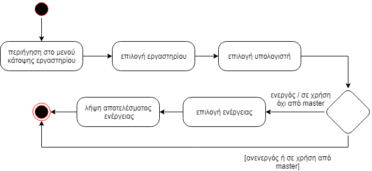

###### Παραδοτέο R2

# ΠΧ5: Απομακρυσμένος έλεγχος μηχανημάτων

* **Πρωτεύων Actor:** Διαχειριστής εργαστηρίου
* **Ενδιαφερόμενοι**:
    * **Διαχειριστής εργαστηρίου**: Θέλει να εκτελέσει συγκεκριμένες ενέργειες πάνω σε επιλεγμένο μηχάνημα.
* Προϋποθέσεις: Πρέπει να έχει εκτελέσει με επιτυχία την ΠΧ "Αυθεντικοποίηση χρήστη".

# Βασική Ροή

### Α) Επιλογή κάτοψης εργαστηρίου

1. Ο χρήστης επιλέγει το activity της [προβολής κάτοψης του εργαστηρίου](uc4-lab-view.md).
2. Ο χρήστης επιλέγει το εργαστήριο που τον ενδιαφέρει.
3. Το σύστημα απαντάει με την λίστα μηχανημάτων του εργαστηρίου.
4. O χρήστης επιλέγει έναν υπολογιστή από την λίστα.
5. Το σύστημα επιστρέφει την κατάσταση του υπολογιστή.
6. Ειδοποιείται για την κατάσταση του υπολογιστή (Ανενεργός, Διαθέσιμος, Σε χρήση).

### Β) Επιλογή υπολογιστή που είναι ανενεργός

1. Ο χρήστης επιλέγει υπολογιστή ο οποίος είναι ανενεργός.
2. Η περίπτωση χρήσης τερματίζει.

### Γ) Επιλογή υπολογιστή που είναι ενεργός

1. Ο χρήστης επιλέγει υπολογιστή ο οποίος είναι ενεργός.
2. Ο διαχειριστής επιλέγει την ενέργεια που θέλει να εκτελέσει (Απενεργοποίηση, Επανεκκίνηση, Hard reset).
3. Το σύστημα επιστρέφει την απάντηση.
    * α) Επιστρέφει επιτυχία και τερματίζει την περίπτωση χρήσης.
    * β) Επιστέφει αποτυχία, ειδοποιεί τον διαχειριστή και τερματίζει την περίπτωση χρήσης.

### Δ) Επιλογή υπολογιστή που είναι σε χρήση

1. Ο χρήστης επιλέγει υπολογιστή ο οποίος είναι σε χρήση.
2. Ο διαχειριστής επιλέγει την ενέργεια που θέλει να εκτελέσει (Απενεργοποίηση, Επανεκκίνηση, Hard reset, Αποσύνδεση, Αποστολή μηνύματος).
    * α) Στον υπολογιστή είναι συνδεδεμένος διαχειριστής (master).
3. Το σύστημα επιστρέφει την απάντηση.
    * α) Επιστρέφει επιτυχία και τερματίζει την περίπτωση χρήσης.
    * β) Επιστέφει αποτυχία, ειδοποιεί τον διαχειριστή και τερματίζει την περίπτωση χρήσης.

**Εναλλακτικές ροές**

*α) Στον υπολογιστή είναι συνδεδεμένος διαχειριστής (master).*
1. Απενεργποιούνται οι επιλογές της αποσύνδεσης, επανεκκίνησης και απενεργοποίησης, καθώς ο διαχειριστής μπορεί να κάνει αναβαθμίσεις.

## Διαγράμματα

### Διάγραμμα δραστηριότητας

