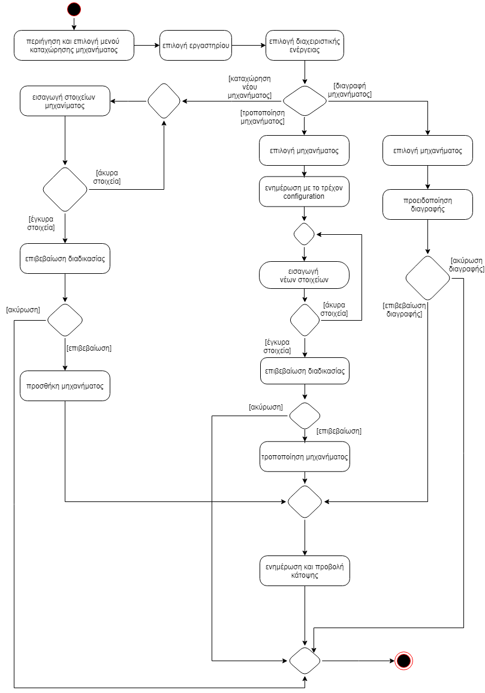
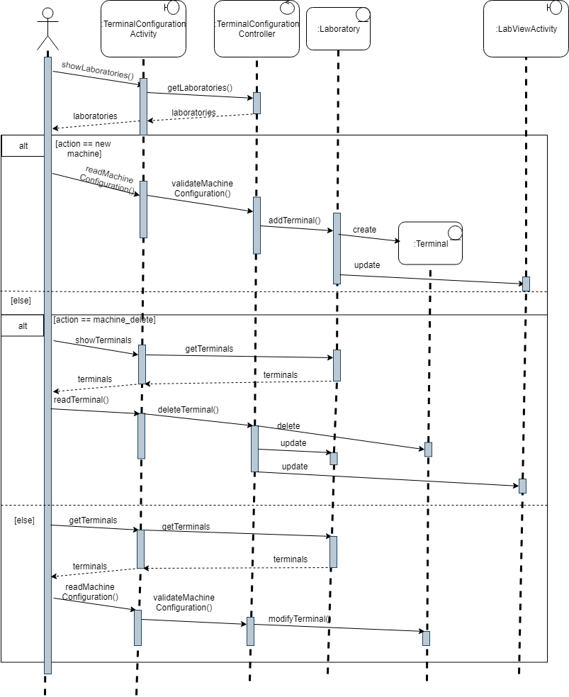

###### Παραδοτέο R2

# ΠΧ7: Καταχώρηση νέων μηχανημάτων

* **Πρωτεύων Actor:** Διαχειριστής εργαστηρίου
* **Ενδιαφερόμενοι**:
    * **Διαχειριστής εργαστηρίου**: Θέλει να εισάγει ένα νέο μηχάνημα στο εργαστήριο.
* Προϋποθέσεις: Πρέπει να έχει εκτελέσει με επιτυχία την ΠΧ "Αυθεντικοποίηση χρήστη".

# Βασική Ροή

### Α) Επιλογή εργαστηρίου

1. Ο διαχειριστής επιλέγει το activity εισαγωγής μηχανήματος.
2. Η εφαρμογή παρουσιάζει τα διαθέσιμα εργαστήρια.
3. Ο διαχειριστής επιλέγει το εργαστήριο που τον ενδιαφέρει.

### Β) Καταχώρηση μηχανήματος

1. Η εφαρμογή μεταφέρει τον διαχειριστή στο activity της καταχώρισης.
2. Ο διαχειριστής πληκτρολογεί τα υποχρεωτικά στοιχεία του νέου μηχανήματος.
3. Η εφαρμογή ελέγχει για λανθασμένα ή διπλότυπα στοιχεία.
    * α) Αν επιστραφεί error, η εφαρμογή προτρέπει τον χρήστη να ελέγξει τα εισαγώμενα στοιχεία.
    * β) Αν επιστραφεί επιτυχία, η εφαρμογή προτρέπει τον χρήστη για επιβεβαίωση εισαγωγής.
4. Το σύστημα προσθέτει το νεό μηχάνημα.
5. Το σύστημα ενημερώνει την κάτοψη του συγκεκριμένου εργαστηρίου.
6. Η εφαρμογή μεταφέρει τον χρήστη στο actitivy της κάτοψης του εργαστηρίου.

### Γ) Τροποποίηση μηχανήματος

1. Η εφαρμογή μεταφέρει τον διαχειριστή στο activity της καταχώρισης.
2. Ο διαχειριστής επιλέγει το μηχάνημα που τον ενδιαφέρει.
3. Η εφαρμογή επιστρέφει το τρέχον configuration του μηχανήματος.
4. Ο διαχειριστής τροποποιεί το μηχάνημα.
5. Η εφαρμογή ελέγχει για λανθασμένα ή διπλότυπα στοιχεία.
    * α) Αν επιστραφεί error, η εφαρμογή προτρέπει τον χρήστη να ελέγξει τα εισαγώμενα στοιχεία.
    * β) Αν επιστραφεί επιτυχία, η εφαρμογή προτρέπει τον χρήστη για επιβεβαίωση εισαγωγής.
6. Το σύστημα τροποποιεί το μηχάνημα.

### Δ) Διαγραφή μηχανήματος

1. Η εφαρμογή μεταφέρει τον διαχειριστή στο activity της καταχώρισης.
2. Ο διαχειριστής επιλέγει το μηχάνημα που τον ενδιαφέρει.
3. Ο διαχειριστής επιλέγει την διαγραφή.
4. Η εφαρμογή προειδοποιεί τον διαχειριστή.
    * α) Αν επιλεγεί η απάντηση ναι, το σύστημα διαγράφει τον υπολογιστή.
    * β) Αν επιλεγεί η απάντηση όχι, η εφαρμογή ακυρώνει την διαδικασία.
5. Το σύστημα ενημερώνει την κάτοψη του συγκεκριμένου εργαστηρίου.
6. Η εφαρμογή μεταφέρει τον χρήστη στο actitivy της κάτοψης του εργαστηρίου.

## Διαγράμματα

### Διάγραμμα δραστηριότητας

### Διάγραμμα ακολουθίας

