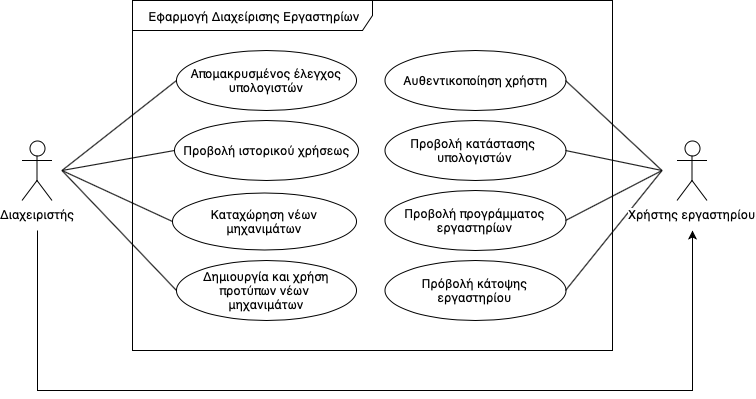

###### Παραδοτέο R1

Εφαρμογή διαχείρισης εργαστηρίων CSLabs
===

## Απαιτήσεις Λογισμικού

Η εφαρμογή έχει ως βασικό στόχο την διευκόλυνση των διαχεριστών στα εκπαιδευτικά εργαστήρια CSLabs όσον αφορά την εκτέλεση των day-to-day εργασιών και παρακολούθησης αυτών. Η εφαρμογή έχει την δυνατότητα ελέγχου πολλαπλών εργαστηρίων.

Βασικές λειτουργείες είναι οι εξής:
* Διαχειριστές εργαστηρίων
    * Σύστημα αυθεντικοποίησης για όλες τις παρακάτω λειτουργείες.
    * Προβολή της κατάστασης των υπολογιστών του εργαστηρίου, καθώς και την εμφάνιση λεπτομερών στοιχείων για τους χρήστες του.
    * Διαχείριση των υπολογιστών του εργαστηρίου με δυνατότητα ελέγχου των υπολογιστών (επανεκκίνιση, αποδύνδεση κλπ.).
    * Εμφάνιση ιστορικού χρήσης σε επίπεδο χρηστών και σε επίπεδο υπολογιστών.
    * Μαζική διαχείριση υπολογιστών ανα εργαστήριο (επανεκκινήσεις, μαζικές αποσυνδέσεις).
    * Καταχώρηση νέων μηχανημάτων, με την χρήση ή χωρίς προτύπων που δημιουργούνται από τους διαχειριστές.
    
* Χρήστες εργαστηρίων
    * Εμφάνιση του προγράμματος των εργαστηρίων.
    * Προβολή μιας κάτοψης του εργαστηρίου για τον εύκολο εντοπισμό θέσης μέσα στο εργαστήριο.
    * Για κάθε υπολογίστή στην κάτοψη αυτή προβάλλεται και η κατάσταση του συγκεκριμένου μηχανήματος.

## Διάγραμμα περιπτώσεων χρήσης

