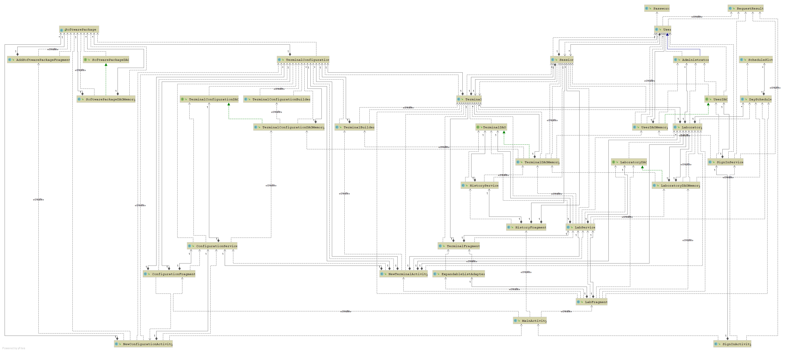
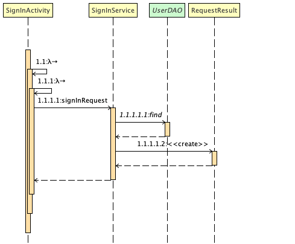
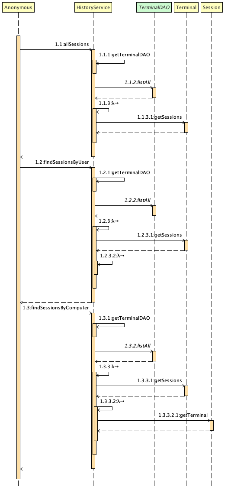
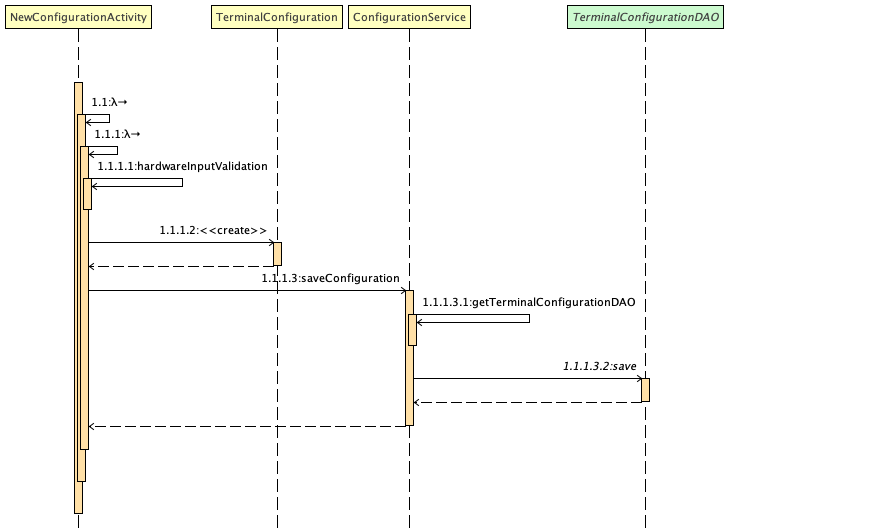

###### Παραδοτέο R4

# Εισαγωγή

Στο παρών έγγραφο θα αναλυθεί η τελική υλοποίηση της εφαρμογής στο Android framework.

# Αρχιτεκτονική Λογισμικού

## Διάγραμμα κλάσεων

Παρακάτων παρουσιάζεται το διάγραμμα κλάσεων που εμπεριέχει όλο το project. Δυστυχώς είναι δυσανάγνωστο από το αρχείο της Markdown.

## Διάγραμμα πακέτων

Τα πακέτα builder, configurations, lab, people, schedule ανήκουν στο domain model. 
Το πακέτα dao & memorydao προσφέρουν πρόσβαση στα δεδομένα μας (Direct Memory Access). 
Το πακέτο services περιέχει τις υπηρεσίες (services), που εδώ λειτουργούν ως presenters.

## Παραδείγματα λειτουργειών

Ακολουθούν τα sequence diagrams για την συνδεση, και ως παράδειγμα την ανάγνωση ιστορικού ανά terminal και την αποθήκευση νέου configuration.

# Coverage Reports

Το report για το coverage του κώδικα μπορεί να δημιουργηθεί μέσα από το Android Studio (Analyze -> Generate Coverage Report), 
αλλά συνοπτικά είχαμε 46% συνολικό coverage, 50% στα services/presenters και 100% σε DAO και μοντέλο πεδίου.
