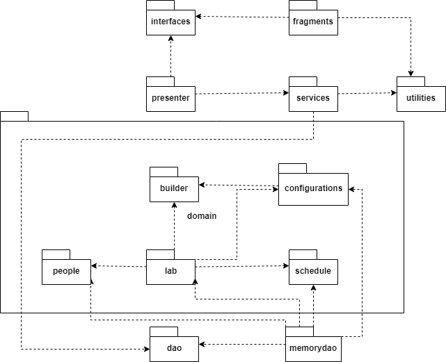
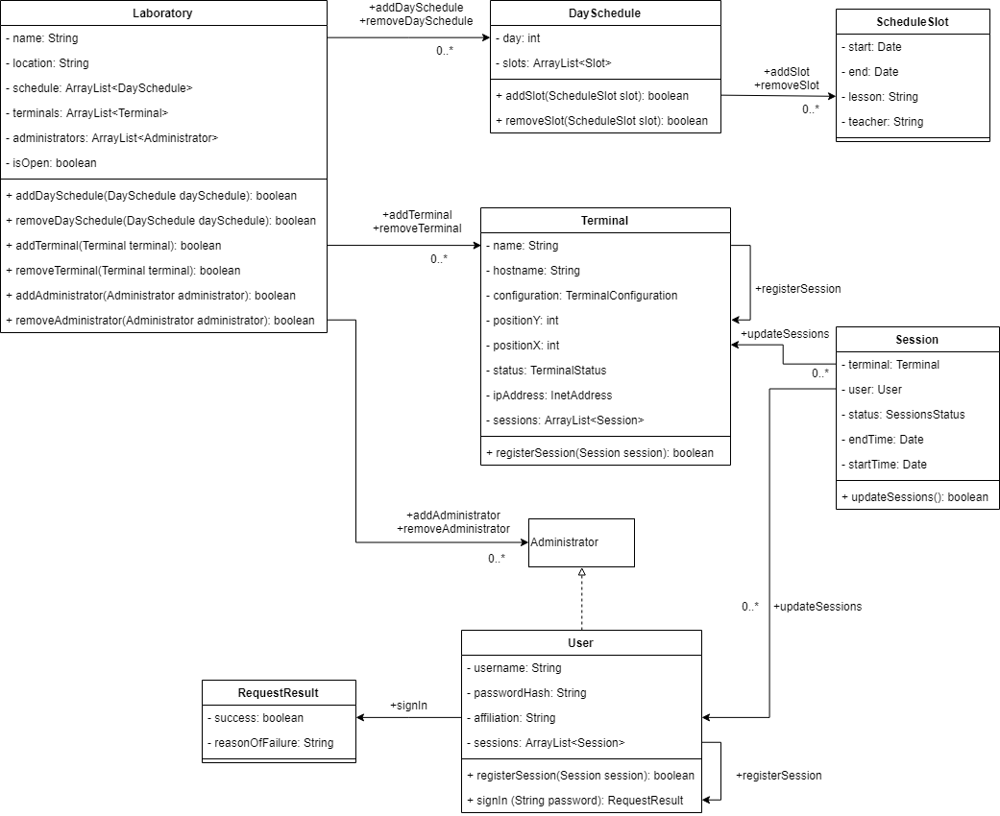
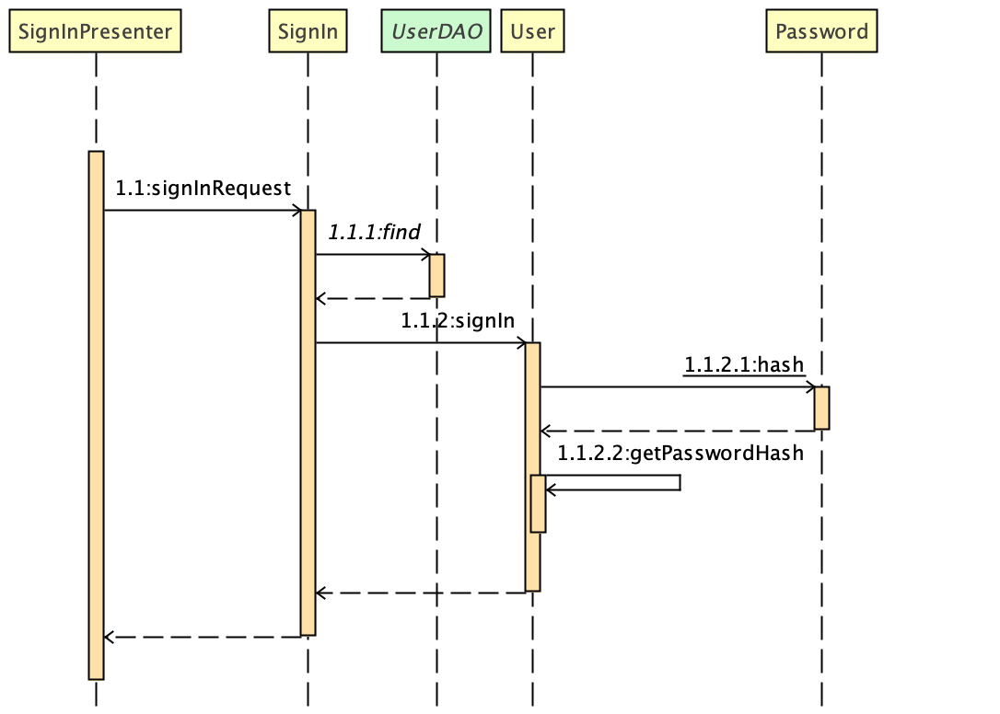

###### Παραδοτέο R3

> Έχει γίνει και μερική υλοποίηση του παραδοτέου με Guice (dependency injection) και Mockito στο branch R3-Guice.

# Εισαγωγή

Στο παρών έγγραφο θα αναλυθούν η λογική της αρχιτεκτονικής και τα διαγράμματα ακολουθίας για την λογική πεδίου. Στο τέλος θα αναρτηθεί coverage report για τον κώδικα.

# Αρχιτεκτονική Λογισμικού

## Διάγραμμα πακέτων

Τα πακέτα builder, configurations, lab, people, schedule ανήκουν στο domain model. Το πακέτα dao & memorydao προσφέρουν πρόσβαση στα δεδομένα μας (Direct Memory Access). Τέλος έχουμε εφαρμόσει το μοντέλο model view presenter για τα fragments που θα δημιουργηθούν στο R4.

# Στατική Όψη Λογικής Πεδίου

Παρακάτω παρουσιάζεται διαγραμματικά η στατική όψη της λογικής πεδίου.

# Διαγράμματα Ακολουθίας Δυναμικής Όψης Λογικής Πεδίου

Παρακάτω παρουσιάζεται διαγραμματικά το διάγραμμα ακολουθίας για το signIn ενός χρήστη.

# Υλοποίηση Λογικής Πεδίου & Testing

Η υλοποίηση της λογικής πεδίου και το testing μπορούν να βρεθούν στο Android Studio Project που έχει αναρτηθεί.

# Coverage Reports

Το report για το coverage του κώδικα μπορεί να βρεθεί στην ιστοσελίδα index.html που βρίσκεται στον φάκελο Deliverables/R3.
