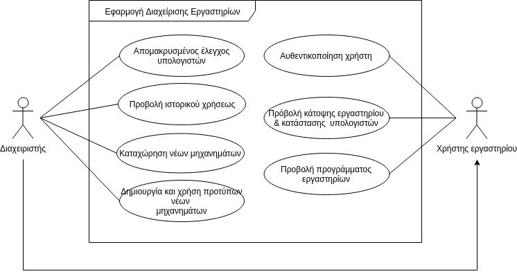

###### Παραδοτέο R2

# Εισαγωγή
Στο παρών έγγραφο θα αναλυθούν όλες οι λεπτομέρεις που αφορούν την εφαρμογή διαφείρισης εργαστηρίων CSLabs. Συγκεκριμένα θα γίνει λεπτομερής ανάλυση των περιπτώσεων χρήσης καθώς και του και του μοντέλου πεδίου του συστήματός μας.

## Εμβέλεια

Το λογισμικό υλοποιεί τις λειτουργίες της γενικότερης επίβλεψης και διαχείρισης των CSLabs. Πιο συγκεκριμένα η εφαρμογή προσφέρει:

- Προβολή των κατόψεων των εργαστηρίων από απλούς χρήστες.
- Προβολή του προγράμματος των εργαστηρίων.
- Προβολή εμπλουτισμένων κατόψεων από διαχειριστές με παραπάνω στοιχεία για κάθε μηχάνημα, όπως πληροφορίες για την τρέχουσα συνεδρία και τον τρέχον χρήστη.
- Διαχείριση της λειτουργείας των μηχανημάτων από διαχειριστές, όπως επανεκκίνηση, αναστολή λειτουργίες και αποσύνδεση τρέχοντα χρήστη.
- Προβολή ιστορικών δεδομένων από διαχειριστές, όπως πληροφορίες για τον εκάστοτε χρήστη και τις συνεδρίες του στα εργαστήρια.
- Προβολή, επεξεργασία, καθώς και δημιουργία και χρήση πρωτοτύπων από διαχειριστές όσον αφορά τα χαρακτηριστικά κάθε μηχανήματος  (όπως επεξεργαστής, κάρτα γραφικών, κλπ.)

Η εφαρμογή δεν θα προσφέρει τα παρακάτω:

- Λειτουργίες απομακρυσμένου ελέγχου.
- Επίβλεψη των διεργασιών.
- Παρακολούθηση της δραστηριότητας των χρηστών του εργαστηρίου.

## Ορισμοί, ακρώνυμα & συντομογραφίες

| Όρος | Επεξήγηση |
|:----:|:---------:|
| CSLab | Computer Science Lab(oratory) - Εργαστήριο Πληροφορικής |
| Διαχειριστής | Ο διαχειριστής είναι ένα άτομο ορισμένο από το προσωπικό του εργαστηρίου το οποίο είναι υπεύθυνο για την ορθή λειτουργία των εργαστηρίων και των μηχανημάτων τους. |
| Χρήστης | Ως χρήστη ονομάζουμε οποιοδήποτε άτομο έχει δικάιωμα χρήσης των εργαστηρίων και των πόρων του. |
| Image | Ως image ορίζουμε την έκδοση του συνόλου των προγραμμάτων και του λειτουργικού συστήματος που είναι εγκατεστημένα σε έναν υπολογιστή. |
| ΑΜ | Αριθμός μητρώου φοιτητή, εργαζόμενου ή καθηγητή |
| Machine ID | Το κωδικό όνομα ενός μηχανήματος. Αποτελείται από τις εξής πληροφορίες: CSLabX-YZ. X: Αριθμός εργαστηρίου, Υ: Σειρά μηχανήματος, Ζ: Αριθμός μηχανήματος |

## Επισκόπηση

Παρακάτω θα αναλυθεί το διάγραμμα περιπτώσεων χρήσης του παραδοτέου R1 σε πίνακα και θα αναλυθούν όλες οι περαιτέρω περιπτώσεις χρήσης. Επίσης θα αναπαρασταθούν σε πίνακα οι περιγραφές των Actors όπως και οι ανάγκες τους. Ακόμα θα αναλυθούν οι συμπληρωματικές προδιαγραφές του συστήματος. Τέλος θα γίνει μια σύντομη περιγραφή των επιχειρησιακών κανόνων και ποιο σημαντικά το υποστηρικτικό υλικό και το βασικό μοντέλο πεδίου.

Στη συνέχεια, θα αναλύσουμε πλήρως το λογισμικό, τους διάφορους χρήστες, τις διεπαφές, τις κλάσσεις του, την οργάνωσή του και άλλα.

# Συνολική Περιγραφή

## Επισκόπηση μοντέλου περιπτώσεων χρήσης

| Περίπτωση Χρήσης | Περιγραφή |
|:----------------:|:---------:|
| ΠΧ1: Αυθεντικοποίηση χρήστη | Η περίπτωση χρήσης για την εξουσιοδότηση σύνδεσης του Χρήστη στην εφαρμογή. |
| ΠΧ2: Προβολή κατάστασης υπολογιστών | Η περίπτωση χρήσης για την προβολή κατάστασης των μηχανημάτων του εργηαστηρίου. |
| ΠΧ3: Προβολή προγράμματος εργαστηρίων | Η περίπτωση χρήσης για την προβολή του τρέχοντος προγράμματος που έχει ανατεθεί στο εργαστήριο. |
| ΠΧ4: Προβολή κάτοψης εργαστηρίου | Η περίπτωση χρήσης για την προβολή της πραγματικής αναπαράστασης των θέσεων εργασίας μέσα στο εργαστήριο. |
| ΠΧ5: Απομακρυσμένος έλεγχος υπολογιστών | Η περίπτωση χρήσης για τον απομακρυσμένο έλεγχο των υπολογιστών του εργαστηρίου. |
| ΠΧ6: Προβολή ιστορικού χρήσεως | Η περίπτωση χρήσης για την προβολή του ιστορικού χρήσης των μηχανημάτων και των χρηστών. |
| ΠΧ7: Καταχώρηση νέων μηχανημάτων | Η περίπτωση χρήσης για την προσθήκη ενός μηχανήματος στην κάτοψη του εργαστηρίου. |
| ΠΧ8: Δημιουργία και χρήση πρότυπων νέων μηχανημάτων | Η περίπτωση χρήσης για την δημιουργία ενός προτύπου υπολογιστή (hardware & image wise) και η προσθήκη του στο σύστημα. |

Όλες οι περιγραφές των περιπτώσεων χρήσης παρέχονται στην υποενότητα περιγραφές περιπτώσεων χρήσης.

## Υποθέσεις & εξαρτήσεις

# Ειδικές Απαιτήσεις

Οι δύο εξαρτήσεις που έχουμε είναι οι εξής:
* Ένα backend σύστημα το οποίο μας παρέχει τις πληροφορίες αυθεντικοποίησης μέσω LDAP server.
* Ένα backend σύστημα το οποίο μας παρέχει τις πληροφορίες για το πρόγραμμα του εργαστηρίου μέσω REST API.
* Μια βάση δεδεμένων για να διατηρείτε το ιστορικό δραστηριότητας μηχανημάτων & χρηστών.

## Περιπτώσεις χρήσης

### Οι ενδιαφερόμενοι & οι ανάγκες τους

Οι ανάγκες των ενδιαφερόμενων αναλύονται στον παρακάτω πίνακα.

| Ενδιαφερόμενος | Ανάγκες |
|:--------------:|:-------:|
| Χρήστης | Να μπορεί να κάνει σύνδεση στα μηχανήματα του εργαστηρίου. |
| | Να μπορεί να δει ποια μηχανήματα είναι κατηλειμμένα και ποια ελεύθερα προς χρήση. |
| | Να μπορεί να δει το τωρινό πρόγραμμα που ισχύει στο εργαστήριο για κάθε μέρα ξεχωριστά. |
| | Να μπορεί να δει τη κάτοψη του εργαστηρίου ώστε να μπορεί να διευκολυνθεί στην εύρυεση της θέση εργασίας που επιθυμεί. |
| Διαχειριστής | Να μπορεί να έλεγξει απομακρυσμένα ένα μηχάνημα για συγκεκριμένες εντολές (Απενεργοποίηση, Επανεκκίνηση, Αποσύνδεση χρήστη). |
| | Να μπορεί να δει το ιστορικό χρήσης ενός μηχανήματος. |
| | Να μπορεί να δει το ιστορικό ενός χρήστη (σε ποια μηχανήματα έχει συνδεθεί). | 
| | Να μπορεί να καταχωρήσει ένα νέο μηχάνημα στην κάτοψη του εργαστηρίου. |
| | Να μπορεί να τροποποιήσει ένα υπάρχων μηχάνημα στην κάτοψη του εργαστηρίου. |
| | Να μπορεί να δημιουργήσει ένα νέο hardware configuration στην εφαρμογή. |
| | Να μπορεί να δημιουργήσει ένα νεό software configuration στην εφαρμογή. |

### Actors του συστήματος

Παρακάτω αναλύονται οι Actors.

| Actor | Περιγραφή | Στόχοι | Ενδιαφερόμενοι |
|:-----:|:---------:|:------:|:--------------:|
| Χρήστης Εργαστηρίου | Είναι ο καθημερινός χρήστης που χρησιμοποιεί τις υπηρεσίες του εργαστηρίου. | Σύνδεση στην εφαρμογή | Χρήστης Εργαστηρίου |
| | | Προβολή του προγράμματος του εργαστηρίου | |
| | | Προβολή της κάτοψης του εργαστηρίου | | 
| | | Προβολή της κατάστασης των υπολογιστών | |
| Διαχειριστής | Είναι υπεύθυνος για την πλήρη διαχείριση των εργαστηρίων | Απομακρυσμένος έλεγχος μηχανημάτων | Διαχειριστής |
| | | Εμφάνιση ιστορικού χρήσης μηχανημάτων & χρηστών | | 
| | | Διαχείρηση κατόψεων | | 
| | | Διαχείρηση των image (hardware & software configurations) | |

### Περιγραφές περιπτώσεων χρήσης

Παρακάτω αναλύονται όλες οι περιπτώσεις χρήσης.

#### [ΠΧ1: Αυθεντικοποίηση χρήστη](uc1-user-auth.md)

#### [ΠΧ2: Προβολή κατάστασης υπολογιστών](uc2-pc-status.md)

#### [ΠΧ3: Προβολή προγράμματος εργαστηρίων](uc3-lab-program.md)

#### [ΠΧ4: Προβολή κάτοψης εργαστηρίου](uc4-lab-view.md)

#### [ΠΧ5: Απομακρυσμένος έλεγχος μηχανημάτων](uc5-remote-control.md)

#### [ΠΧ6: Προβολή ιστορικού χρήσης](uc6-history.md)

#### [ΠΧ7: Καταχώρηση νέων μηχανημάτων](uc7-machine-registration.md)

#### [ΠΧ8: Δημιουργία και χρήση προτύπων νέων μηχανημάτων](uc8-configuration-generation.md)

## Συμπληρωματικές προδιαγραφές

### Απαιτήσεις διεπαφών

#### Διεπαφές χρήστη

* Όλες οι διεπαφές χρήστη θα είναι κατασκευασμένες μέσω XML (Android).
* Όλες οι διεπαφές θα συνοδεύονται από επεξήγηση σε ειδικό activity που συνδέεται με την διεπαφή στην οποία βρίσκεται.

#### Διεπαφες υλικού

Δεν έχουμε διεπαφές υλικού.

#### Διεπαφές επικοινωνίας

Δεν έχουμε διεπαφές επικοινωνίας.

#### Διεπαφές λογισμικού

* Το σύστημα θα επικοινωνεί με REST API για την απόκτηση του προγράμματος του εργαστηρίου.

* Το σύστημα θα επικοινωνεί με REST API για την απόκτηση της κάτοψης του εργαστηρίου και τις διαθεσιμότητας όλων των υπολογιστών.

### Περιορισμοί σχεδίασης & υλοποίησης

* Το σύστημα θα αναπτυχθεί σε Java.
* Το σύστημα θα μπορεί να εκτελείται σε εικονικές μηχανές της Java από την έκδοση 7.0 ή νεότερη.

### Ποιοτικά χαρακτηριστικά

#### Απόδοση

Το σύστημα θα πρέπει να μπορεί να υποστηρίξει μέχρι και 1000 μηχανήματα και χρήστες, και ταυτόχρονη χρήση από 100 διαχειριστές.

#### Διαθεσιμότητα

Το σύστημα πρέπει να είναι διαθέσιμο προς χρήση 24/7, ανεξαρτήτος εάν βρίσκονται χρήστες συνδεδεμένοι ή εάν το εργαστήριο λειτουργεί.

#### Ασφάλεια

Όλες οι λειτουργίες θα πραγματοποιούνται μέσω διαδικασία αυθεντικοποίησης.

#### Ευελιξία

Ο χρήστης μπορεί να χρησιμοποιήσει την εφαρμογή για μεγάλη γμάμα εργαστηρίων πληροφορικής, με κύρια χαρακτηριστικά το κοινό σύστημα αυθεντικοποίησης και την χρήση κοινού δικτίου. Εάν αυτές οι συνθήκες ικανοποιούνται, τότε πολύ πιθανώς η εφαρμογή να υποστηρίζει εκείνο το εργαστήριο.

# Υποστηρικτικό Υλικό

## Μοντέλο πεδίου

## Ανάλυση περιπτώσεων χρήσης
----------------

### Κλάσεις ανάλυσης

### Συμπεριφορές